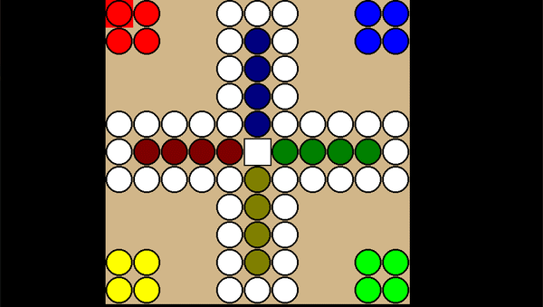

# MaDn

## How to play:
Try to get all four pawns as fast as you can in the 'home' position and dont get angry when your pawn is hit just before your victory!!

## Screenshots
 
- <kbd>D-Pad</kbd> - Move selected field
- <kbd>Cross</kbd> - Select pawn
- <kbd>Touch</kbd> - Select and move pawn

## Known Bugs / Limitations

- When you select a pawn which cannot enter the home position you will lose your turn!!, when available select another pawn
